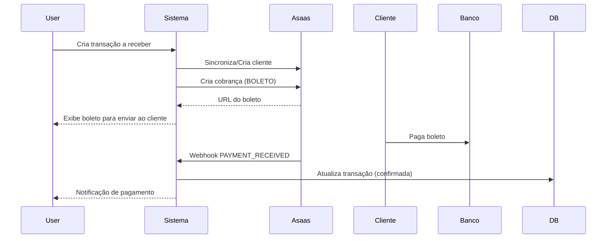
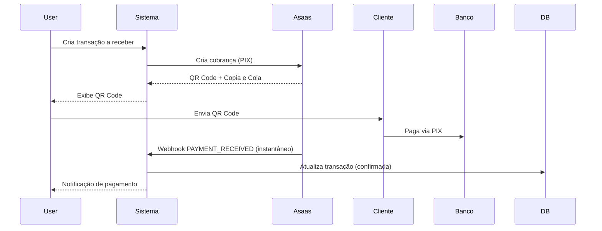

# 💳 Integração de Pagamentos - Asaas e PagBank

## 📋 Índice

1. [Visão Geral](#visão-geral)
2. [Asaas - Configuração](#asaas---configuração)
3. [API Endpoints](#api-endpoints)
4. [Webhooks](#webhooks)
5. [Frontend - Interface](#frontend---interface)
6. [Fluxo de Uso](#fluxo-de-uso)
7. [Segurança](#segurança)

---

## 🎯 Visão Geral

Sistema de integração com gateways de pagamento **preparado e pronto** para ser ativado assim que você tiver as credenciais.

### Gateways Suportados

- ✅ **Asaas** - Implementado e testado (Sandbox + Production)
- 🔜 **PagBank** - Estrutura pronta, aguardando documentação

### Funcionalidades Implementadas

| Funcionalidade | Asaas | PagBank |
|----------------|-------|---------|
| Criar cobranças | ✅ | 🔜 |
| Boleto bancário | ✅ | 🔜 |
| PIX | ✅ | 🔜 |
| Cartão de crédito | ✅ | 🔜 |
| Assinaturas | ✅ | 🔜 |
| Webhooks | ✅ | 🔜 |
| Clientes | ✅ | 🔜 |
| Reembolsos | ✅ | 🔜 |
| Transferências | ✅ | 🔜 |

---

## 🔧 Asaas - Configuração

### 1. Obter API Key

1. Acesse sua conta Asaas
2. Vá em **Minha Conta** → **Integração** → **Gerar API Key**
3. Escolha o ambiente:
   - **Sandbox**: Para testes (recomendado para começar)
   - **Production**: Para uso real

### 2. Configurar no Sistema

#### Via API (Recomendado)

```bash
POST /api/payment-gateway/config

{
  "gateway": "asaas",
  "environment": "sandbox", # ou "production"
  "apiKey": "SUA_API_KEY_AQUI",
  "webhookSecret": "seu-secret-opcional",
  "isActive": true,
  "config": {
    "enableBoleto": true,
    "enablePix": true,
    "enableCreditCard": true,
    "defaultDueDays": 7,
    "defaultFine": 2,  # 2%
    "defaultInterest": 1  # 1% ao mês
  }
}
```

#### Via Interface Web

1. Acesse **Configurações** → **Integrações** → **Pagamentos**
2. Selecione **Asaas**
3. Cole sua API Key
4. Escolha o ambiente (Sandbox/Production)
5. Configure opções adicionais
6. Clique em **Testar Conexão**
7. Se OK, clique em **Salvar**

### 3. Configurar Webhooks no Asaas

No painel do Asaas, configure a URL do webhook:

```
https://api.nexusatemporal.com.br/api/payment-gateway/webhooks/asaas
```

**Eventos recomendados:**
- ✅ PAYMENT_CREATED
- ✅ PAYMENT_RECEIVED
- ✅ PAYMENT_CONFIRMED
- ✅ PAYMENT_OVERDUE
- ✅ PAYMENT_REFUNDED
- ✅ PAYMENT_DELETED

---

## 🌐 API Endpoints

### Configuração

```bash
# Salvar/Atualizar configuração
POST /api/payment-gateway/config
Body: { gateway, environment, apiKey, config }

# Listar configurações
GET /api/payment-gateway/config

# Obter configuração específica
GET /api/payment-gateway/config/:gateway/:environment

# Deletar configuração
DELETE /api/payment-gateway/config/:gateway/:environment

# Testar conexão
POST /api/payment-gateway/test/:gateway
Response: { success: true, balance: {...} }
```

### Clientes

```bash
# Criar/Sincronizar cliente
POST /api/payment-gateway/customers
Body: {
  gateway: "asaas",
  leadId: "uuid-do-lead",  # Opcional
  name: "Nome do Cliente",
  email: "email@example.com",
  cpfCnpj: "12345678900",
  phone: "(11) 98765-4321",
  mobilePhone: "(11) 98765-4321",
  address: "Rua Exemplo",
  addressNumber: "123",
  complement: "Apto 45",
  province: "Centro",
  postalCode: "01234-567",
  city: "São Paulo",
  state: "SP"
}

# Buscar cliente por lead
GET /api/payment-gateway/customers/lead/:leadId?gateway=asaas
```

### Cobranças

```bash
# Criar cobrança
POST /api/payment-gateway/charges
Body: {
  gateway: "asaas",
  customer: "cus_000001234567",  # ID do cliente no Asaas
  billingType: "BOLETO",  # BOLETO, PIX, CREDIT_CARD, DEBIT_CARD
  value: 250.00,
  dueDate: "2025-10-25",  # YYYY-MM-DD
  description: "Pagamento do procedimento X",
  externalReference: "PROC-12345",
  discount: {
    value: 10,
    dueDateLimitDays: 5,
    type: "PERCENTAGE"  # FIXED ou PERCENTAGE
  },
  fine: {
    value: 2,
    type: "PERCENTAGE"
  },
  interest: {
    value: 1,
    type: "PERCENTAGE"
  }
}

# Listar cobranças
GET /api/payment-gateway/charges/:gateway?offset=0&limit=50

# Obter cobrança específica
GET /api/payment-gateway/charges/:gateway/:chargeId

# Obter QR Code PIX
GET /api/payment-gateway/charges/:gateway/:chargeId/pix
Response: {
  encodedImage: "data:image/png;base64,...",
  payload: "00020126580014br.gov.bcb.pix...",
  expirationDate: "2025-10-18T10:00:00"
}

# Reembolsar cobrança
POST /api/payment-gateway/charges/:gateway/:chargeId/refund
Body: {
  value: 100.00,  # Opcional (se não informar, reembolsa tudo)
  description: "Motivo do reembolso"
}
```

### Webhooks (Logs e Gerenciamento)

```bash
# Listar webhooks recebidos
GET /api/payment-gateway/webhooks/logs?gateway=asaas&status=processed&limit=50

# Reprocessar webhook falhado
POST /api/payment-gateway/webhooks/:id/retry
```

---

## 🪝 Webhooks

### Funcionamento

1. **Asaas envia notificação** → `https://api.nexusatemporal.com.br/api/payment-gateway/webhooks/asaas`
2. **Sistema armazena** o webhook na tabela `payment_webhooks`
3. **Processamento assíncrono** atualiza:
   - `payment_charges` - Status da cobrança
   - `transactions` - Transação financeira vinculada (se houver)
4. **Registro completo** para auditoria e retry

### Eventos Principais

| Evento | Descrição | Ação Automática |
|--------|-----------|-----------------|
| `PAYMENT_RECEIVED` | Pagamento recebido | Atualiza cobrança e transação para "confirmada" |
| `PAYMENT_CONFIRMED` | Pagamento confirmado | Atualiza status |
| `PAYMENT_OVERDUE` | Pagamento vencido | Atualiza status para "atrasado" |
| `PAYMENT_REFUNDED` | Pagamento reembolsado | Atualiza valor reembolsado |
| `PAYMENT_DELETED` | Cobrança deletada | Marca como deletada |

### Estrutura do Webhook

```json
{
  "event": "PAYMENT_RECEIVED",
  "payment": {
    "id": "pay_123456789",
    "customer": "cus_000001234567",
    "status": "RECEIVED",
    "value": 250.00,
    "netValue": 243.75,
    "billingType": "BOLETO",
    "paymentDate": "2025-10-18",
    "confirmedDate": "2025-10-18T10:30:00",
    "description": "Pagamento do procedimento X",
    "externalReference": "PROC-12345"
  }
}
```

---

## 💻 Frontend - Interface

### Página de Configuração

**Localização**: `/configuracoes/integracoes/pagamentos`

```tsx
// Componente de configuração Asaas
<PaymentGatewayConfig gateway="asaas" />
```

**Campos:**
- API Key (input com mascara ***)
- Ambiente (Production / Sandbox)
- Habilitar Boleto (toggle)
- Habilitar PIX (toggle)
- Habilitar Cartão de Crédito (toggle)
- Dias de vencimento padrão (número)
- Multa padrão (%)
- Juros por mês (%)
- Botão "Testar Conexão"
- Botão "Salvar"

### Criar Cobrança

**Integrado com:** Módulo de Leads / Transações Financeiras

```tsx
// Ao criar uma transação a receber
<CreateChargeButton
  leadId={lead.id}
  amount={transaction.value}
  dueDate={transaction.dueDate}
  gateway="asaas"
  billingType="PIX"  // ou BOLETO
/>
```

**Fluxo:**
1. Sistema verifica se lead já é cliente no Asaas
2. Se não, cria cliente automaticamente
3. Cria cobrança no Asaas
4. Exibe boleto ou PIX para o usuário
5. Vincula cobrança à transação financeira
6. Webhook atualiza automaticamente quando pago

---

## 🔄 Fluxo de Uso

### Cenário 1: Cobrar Cliente via Boleto



### Cenário 2: Cobrar Cliente via PIX



---

## 🔐 Segurança

### Criptografia de Credenciais

As API Keys são **criptografadas** antes de serem armazenadas no banco de dados:

```typescript
// AES-256-CBC encryption
const encrypt(text: string): string {
  const key = crypto.scryptSync(process.env.ENCRYPTION_KEY, 'salt', 32);
  const iv = crypto.randomBytes(16);
  const cipher = crypto.createCipheriv('aes-256-cbc', key, iv);
  let encrypted = cipher.update(text, 'utf8', 'hex');
  encrypted += cipher.final('hex');
  return iv.toString('hex') + ':' + encrypted;
}
```

**Importante:** Defina `ENCRYPTION_KEY` no `.env` do backend:

```bash
ENCRYPTION_KEY=sua-chave-super-secreta-aqui-minimo-32-caracteres
```

### Webhook Security

1. **IP Whitelist**: Registre IPs do Asaas no firewall
2. **Webhook Secret**: Configure um secret compartilhado
3. **HTTPS Only**: Webhooks só funcionam em HTTPS
4. **Signature Validation**: Valide assinaturas dos webhooks (quando disponível)

---

## 🧪 Testando a Integração

### 1. Ambiente Sandbox

Use o ambiente sandbox do Asaas para testar:

```bash
# Obter API Key de Sandbox
https://sandbox.asaas.com/

# Configurar no sistema
POST /api/payment-gateway/config
{
  "gateway": "asaas",
  "environment": "sandbox",
  "apiKey": "$aact_...",  # Sua key sandbox
  "isActive": true
}
```

### 2. Testar Conexão

```bash
POST /api/payment-gateway/test/asaas

# Response esperado:
{
  "success": true,
  "message": "Connection successful",
  "balance": {
    "balance": 0.00
  }
}
```

### 3. Criar Cobrança de Teste

```bash
# 1. Criar cliente
POST /api/payment-gateway/customers
{
  "gateway": "asaas",
  "name": "Cliente Teste",
  "cpfCnpj": "12345678900",
  "email": "teste@example.com"
}

# Response: { "id": "...", "gatewayCustomerId": "cus_000..." }

# 2. Criar cobrança PIX
POST /api/payment-gateway/charges
{
  "gateway": "asaas",
  "customer": "cus_000...",  # ID retornado acima
  "billingType": "PIX",
  "value": 10.00,
  "dueDate": "2025-10-25",
  "description": "Teste de integração"
}

# Response: { "id": "pay_...", "status": "PENDING", ... }

# 3. Obter QR Code
GET /api/payment-gateway/charges/asaas/pay_.../pix

# Response: { "encodedImage": "data:image/png...", "payload": "0002..." }
```

### 4. Simular Pagamento (Sandbox)

No painel sandbox do Asaas, você pode:
- Marcar cobrança como paga manualmente
- Simular webhooks
- Testar diferentes cenários

---

## 📊 Tabelas do Banco de Dados

### payment_configs
Armazena configurações dos gateways

| Campo | Tipo | Descrição |
|-------|------|-----------|
| id | UUID | ID único |
| tenantId | VARCHAR | Tenant |
| gateway | VARCHAR | asaas ou pagbank |
| environment | VARCHAR | production ou sandbox |
| apiKey | TEXT | API Key (criptografada) |
| apiSecret | TEXT | Secret (criptografado) |
| webhookSecret | TEXT | Secret para webhooks |
| isActive | BOOLEAN | Se está ativa |
| config | JSONB | Configurações adicionais |

### payment_customers
Mapeia clientes locais para IDs dos gateways

| Campo | Tipo | Descrição |
|-------|------|-----------|
| id | UUID | ID único |
| tenantId | VARCHAR | Tenant |
| gateway | VARCHAR | Gateway |
| leadId | UUID | Lead vinculado (FK) |
| gatewayCustomerId | VARCHAR | ID no gateway |
| name, email, cpfCnpj, etc | - | Dados do cliente |

### payment_charges
Cobranças criadas nos gateways

| Campo | Tipo | Descrição |
|-------|------|-----------|
| id | UUID | ID único |
| tenantId | VARCHAR | Tenant |
| gateway | VARCHAR | Gateway |
| gatewayChargeId | VARCHAR | ID no gateway |
| gatewayCustomerId | VARCHAR | Cliente no gateway |
| leadId | UUID | Lead vinculado (FK) |
| transactionId | UUID | Transação financeira (FK) |
| billingType | VARCHAR | BOLETO, PIX, etc |
| value | DECIMAL | Valor |
| status | VARCHAR | Status da cobrança |
| bankSlipUrl | TEXT | URL do boleto |
| pixQrCode | TEXT | QR Code PIX (base64) |
| rawResponse | JSONB | Resposta completa do gateway |

### payment_webhooks
Registro de webhooks recebidos

| Campo | Tipo | Descrição |
|-------|------|-----------|
| id | UUID | ID único |
| tenantId | VARCHAR | Tenant |
| gateway | VARCHAR | Gateway |
| event | VARCHAR | Tipo de evento |
| status | VARCHAR | pending, processed, failed |
| payload | JSONB | Payload completo |
| processedAt | TIMESTAMP | Quando foi processado |
| errorMessage | TEXT | Erro (se houver) |

---

## 🚀 Próximos Passos

1. ✅ Obter API Key do Asaas (Sandbox para testar)
2. ✅ Configurar no sistema via interface
3. ✅ Testar conexão
4. ✅ Configurar webhook no painel Asaas
5. ✅ Criar primeira cobrança de teste
6. ✅ Simular pagamento e verificar webhook
7. ✅ Quando tudo OK, migrar para Production

---

## 📞 Suporte

- **Asaas**: https://ajuda.asaas.com/
- **Documentação Asaas**: https://docs.asaas.com/
- **Discord Asaas**: Link no portal de desenvolvedores

---

**Desenvolvido com** [Claude Code](https://claude.com/claude-code) 🤖
